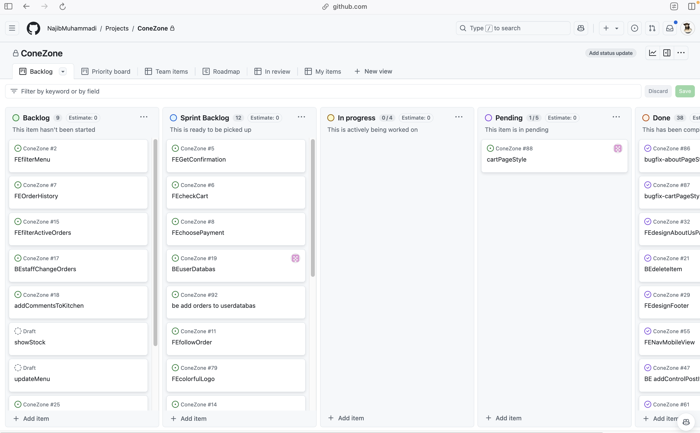
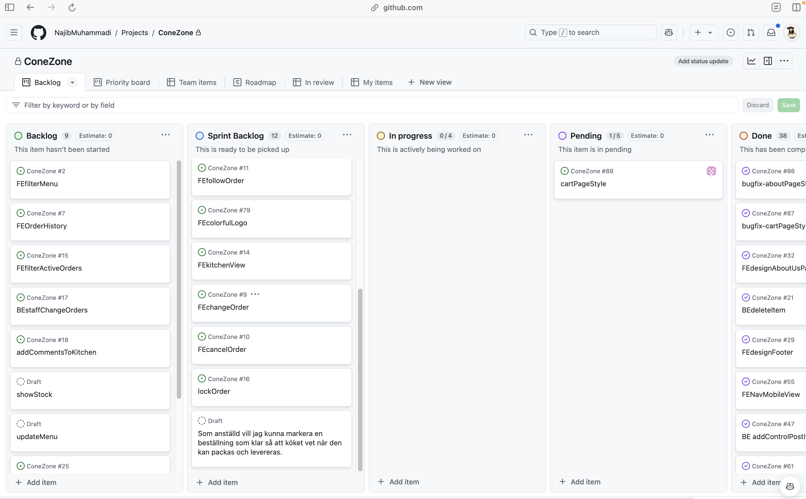

# Sprintplanering 11/11 - 2024
Vi ska lägga in saker i vår sprintplanering. 
Vi går igenom vår backlogg och planerar upp arbetet – lägger in issues i sprint backlog. 

Medverkande: Najib, Diliara, Ida, Lisa

## Daily Scrum 12/11 
Fortsatt arbete. Start på frontend. 

Medverkande: Najib, Diliara, Ida, Lisa

## Daily Scrum 13/11 
Fortsatt arbete med de första frontend-delarna. Diskussion kring backend och Middy. 

Medverkande: Najib, Diliara, Ida, Lisa

## Daily Scrum 14/11 
Fortsatt arbete med varsin del som vi arbetar med.  

Medverkande: Najib, Diliara, Ida, Lisa

# Sprint Retrospektiv 15/11
Diliara – kändes bra. Mycket frontend och design. Vill jobba lite mer backend nästa sprint. Fortsätta jobba på. 
Najim – Första veckan kändes bra. Satt mycket med backend i början, kanske kunde delat upp det mer? 
Ida – Bra uppdelning i arbetsbelastning men på olika fronter. Skulle vilja ha svårare uppgifter. Tar gärna middyn. Känns bra med flyt i arbetet själv. Ska sluta vara lat (felsöka själv mer). 
Lisa – Upplever bra arbetsbelastning. Arbetsfördelning. Har jobbat mycket med design den här veckan. Kul att komma i gång med zustand. Ska ta upp ändringar i gruppen innan de görs. 

Medverkande: Najib, Diliara, Ida, Lisa

# Sprintplanering 15/11 - 2024
Vi lägger in saker i vår sprintplanering. 
Vi går igenom vår backlogg och planerar upp arbetet – lägger in issues i sprint backlog. Utseende på frontend-sidorna, cart och att kunna lägga en fake-order. Bygga upp backend med order och Middy.

Medverkande: Najib, Diliara, Ida, Lisa

# Sprint 2 (vecka 47)

Sprint planering genomfördes på Fredag sprint 1 (efter sprint review och retrospective).

# Sprint review
Kunden var nöjd med framstegen och uppskattade möjligheten att logga in med både användarnamn och email. 
Han föreslog att justera mellanrummet mellan checkbox och texten i payment method layout för bättre design.

Medverkande: Najib, Diliara, Ida, Lisa

# Sprint Retrospektiv
Lisa: Produktiv vecka med bra samarbete med Ida. Fick saker gjort under dagtid istället för kvällar.
Diliara: Backend-arbetet var en utmaning efter två veckor med frontend. Behöver ta raster och undvika att fastna.
Ida: Samarbetet med Lisa var givande, gillade parprogrammering. Vissa delar av frontend kändes osäkra.
Najib: Arbetet gick bra, men behöver bli bättre på att pausa och hitta balans.

## Vad kan förbättras?
Ta fler raster och hålla balans mellan arbete och vila.
Arbeta effektivt under dagtid för att undvika sena kvällar.

Medverkande: Najib, Diliara, Ida, Lisa

# Sprintplanering V.3

Medverkande: Najib, Diliara, Ida, Lisa

